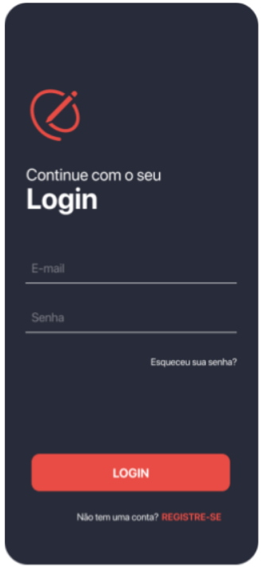
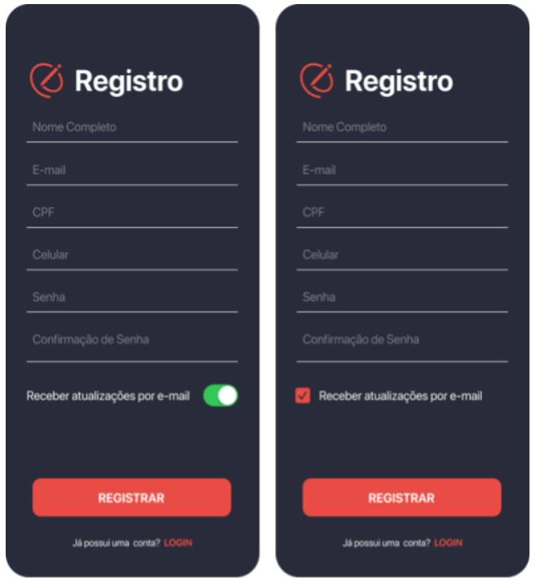
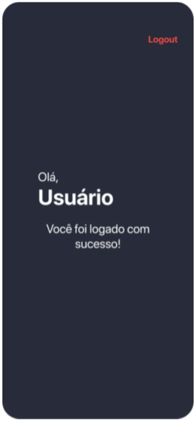

# Logue o usuário

Olá! Obrigado por ter se aplicado para essa vaga, esperamos que você aprenda algo novo.

O principal objetivo desde desafio é ver como você trabalha e como soluciona problemas.

Então, vamos começar.

Seu objetivo neste teste é fazer o fluxo de entrada em um aplicativo. Este fluxo compreende as telas de login, registro e home (definidas mais abaixo).

O fluxo deve funcionar da seguinte maneira:
* Ao abrir o aplicativo o usuário será direcionado para a tela de login para informar seus dados.
* Caso já possua registro, ao informar dados válidos, o usuário deve ser direcionado para a home.
* Caso seja um usuário novo (sem registro) o usuário deverá pressionar "registre-se" e ser direcionado para a tela de cadastro.
* Ao abrir a home, deverá aparecer a mensagem dizendo: "Olá, <nome do usuário retornado na request>"

Definição das telas:

### Login



### Tela de registro



Tela de registro de acordo com cada plataforma

### Home



## Regras:
1 - Login/Cadastro:
* Todos os campos são obrigatórios, exceto a autorização para envio de atualizações via e-mail.
* Endereço de email deve seguir padrão válido de endereços de email.
* O nome completo deve possuir duas palavras pelo menos (um nome e um sobrenome).
* O CPF, sem formatação, deve possuir exatamente 11 dígitos.
* O telefone celular do usuário deve ter exatamente 11 dígitos, contando com o número e DDD.
* A senha do usuário deve ter no mínimo 8 caracteres, contendo pelo menos uma letra maiúscula e um número.
* A confirmação de senha deve ser igual à senha inserida no campo anterior.
* Quando os valores inseridos nos campos forem inválidos, deve-se exibir as mensagens de erro conforme os cenários abaixo:
* E-mail inválido: "E-mail inválido"
    * Senha ou E-mail em branco (tela de logjn): "Campo Obrigatório"
    * Nome de usuário incompleto: "Nome e sobrenome são necessários"
    * Número de telefone incompleto: "O número de telefone deve conter 11 dígitos, contando com o DDD"
    * CPF incompleto: “CPF inválido”
    * Senha não cumpre os requisitos (tela de cadastro): "A senha deve possuir pelo menos oito caracteres, ao menos uma letra maiúscula e um número"
    * Confirmação de senha digitada seja diferente da senha original: "A confirmação de senha deve ser igual à senha inserida"
* Enquanto a requisição estiver em andamento o aplicativo deve:
    * Exibir um Activity Indicator/Progress Bar na tela para indicar o carregamento da solicitação.
    * Bloquear a edição dos campos e botões
* No campo "Email": Utilizar o teclado de e-mails
* No campo "Senha": Deve ter seus caracteres protegidos.
* No campo "Telefone Celular":
    * Aplicar máscara ao valor de entrada no padrão: "(##) #####-####"
    * Utilizar o teclado numérico
* Tela de cadastro - Ao concluir a edição de cada campo, o foco do usuário deve ser movido para o próximo campo, com exceção do último campo do formulário, que irá apenas dispensar o teclado.
* Em caso de erro no envio de dados ao servidor o aplicativo exibe a mensagem ao usuário: "Ocorreu um erro ao efetuar <a operação>. Verifique sua conexão e tente novamente."


## Requisições

### Cadastro
Método: POST

Endpoint: `https://us-central1-rh-challenges.cloudfunctions.net/api/users`

Body:
```
{
	"name": "Nome do Usuário",
	"email": "usuario@teste.com",
	"phoneNumber": "1199998888",
	"password": "R123ayay",
	"emailUpdatesAllowed": false,
	"cpf": "75540308840"
}
```

Resposta:
**200**

```
{
  "user": {
    "name": "Nome do Usuário",
    "id": "7c868290-df77-4458-a593-08813b324848",
    "email": "usuario2@teste.com",
    "cpf": "75540308840",
    "phoneNumber": "1199998888",
    "emailUpdatesAllowed": false,
    "password": "$2b$12$y41xxlSNli3zHk/KcYdtMOApPUEaWvmeOMl8Acbg9/kHqp5j0yxbm"
  }
}
```

### Login

Método: POST

Endpoint: `https://us-central1-rh-challenges.cloudfunctions.net/api/users/token`

Body:
```
{
	"email" : "usuario@teste.com",
	"password" : "R123ayay",
}
```

Resposta:
**200**

```
{
  "token": "token do usuário",
  "user": {
    "id": "uuid",
    "name": "Nome do Usuário",
    "email": "usuario@teste.com",
    "password": "",
    "cpf": "75540308840"
  }
}
```

## Critérios de avaliação

Determine uma arquitetura organizada e bem definida como se tivesse fazendo um projeto real.
Não esqueça de fazer os testes unitários.
Testes de tela serão considerados um ponto extra.
Crashes ao inicializar ou não funcionamento em fluxos básicos serão considerados eliminatórios, portanto teste antes de enviar.
Capriche e faça como se estivesse de fato trabalhando em um projeto para Dextra. A idéia desse teste é conseguir conhecer um pouquinho da sua forma de trabalhar.

Envio do projeto pronto

Envie o link do projeto git do seu teste. 
Faça o upload do .apk no Google Drive e compartilhe conosco. (Lembre-se de deixar o link compartilhado para todos)

